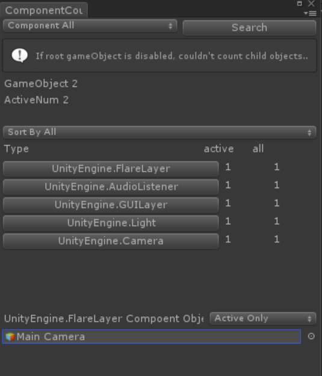

ComponentCounterについて
シーン中のComponentを調査するために作成しました。

  

使用方法
　メニューの「Window」の中にある「ComponentCountDebug」で Windowが立ち上がります。

Update 
2016/03/23
　MonoBehaviourだけでなく、Componentも取れるようにしました。
　その結果、プロジェクト名を変えます